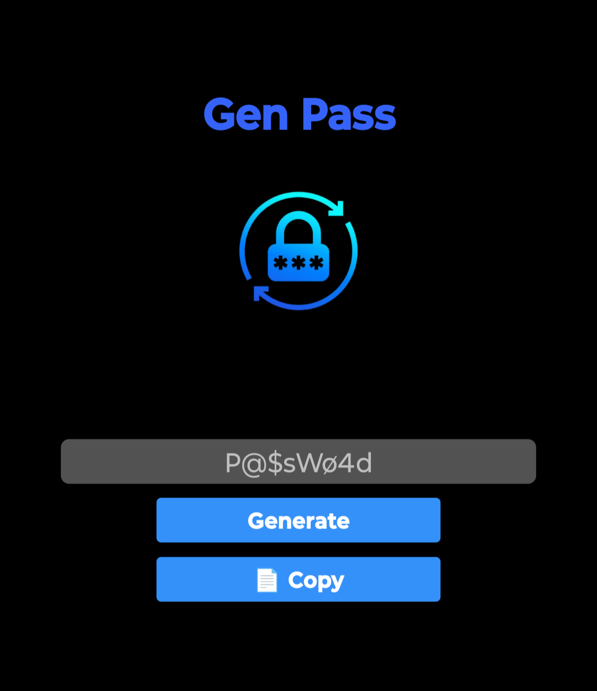

<h1 align="center">Gen Pass</h1>

<p align="center">
  This application is designed for generating secure passwords easily
</p>
<div align="center">
    
</div>


## Features
- Passwords random generation: Generate a random 12 characters easily. (news upcoming)
- Clipboard Support: Quickly copy generated passwords to the clipboard.

## Project Structure
- src/: Contains the main application logic.
- assets/: Stores any static assets.

## Installation
1. Clone the repository:
``` bash
git clone https://github.com/gufvr/gen-pass.git
```
2. Navigate to the project directory:
``` bash
cd gen-pass
```
3. Install dependencies:
``` bash
npm install
```

## Usage
Start the application:
``` bash
npm start
```

## Download APK
You can download the APK file to run the application on your mobile device [here](https://drive.google.com/file/d/1xRB5PD9G7-AxHMBkOxH1bKn7wMk8NOon/view?usp=drive_link).

## License
This project is open-source and available under the **MIT License**.
